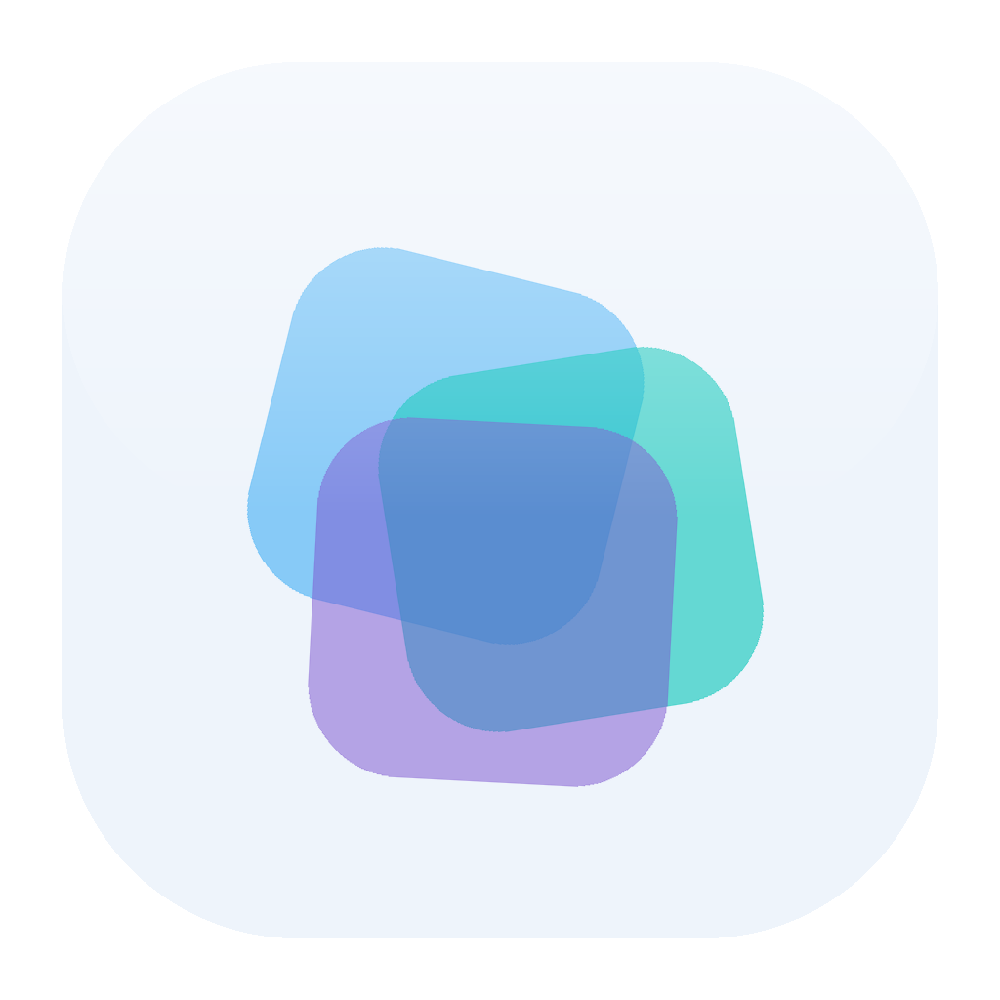
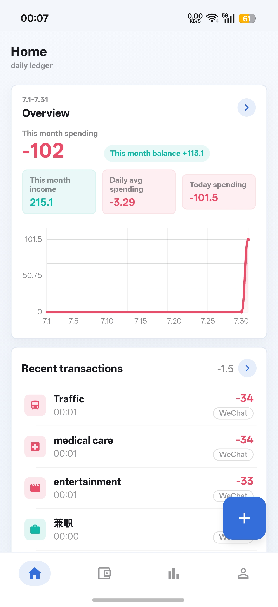
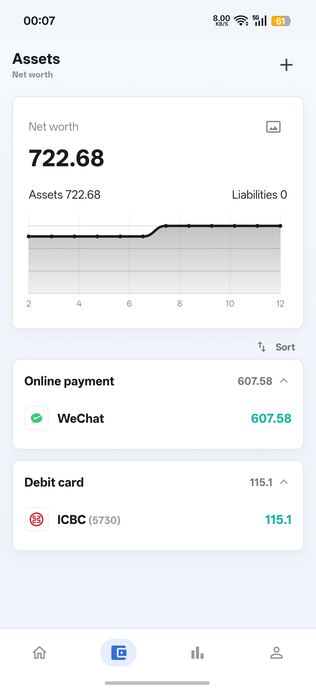
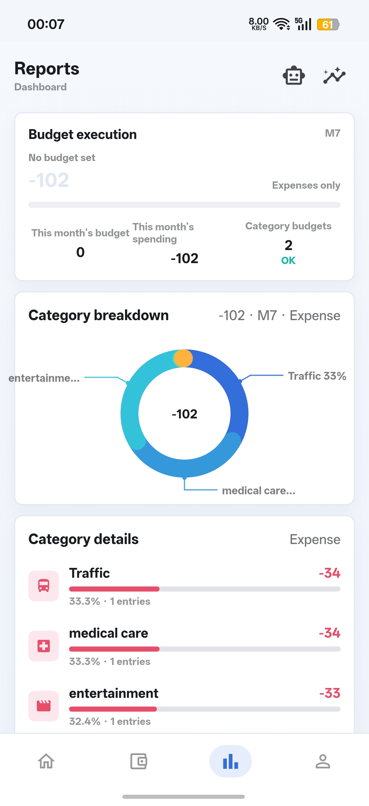

<div align="center">

**English** · <a href="README.md">简体中文</a>



# Veri Fin

**Completely Free · Full Ownership of Your Data · Local-First Android Expense Tracker**

Every transaction stays on your phone—no servers, no accounts, no ads, zero data collection.

[](https://flutter.dev)
[](https://dart.dev)
[](#)
[](https://github.com/LumiDesk/verifin/releases)
[](https://github.com/LumiDesk/verifin/releases)
[](LICENSE)
[](https://afdian.com/a/talyra42)

[Highlights](#-highlights) · [Screenshots](#-screenshots) · [Tech Stack](#-tech-stack) · [Quick Start](#-quick-start) · [Docs](#-docs)

</div>

---

## 📱 Screenshots

<div align="center">

| Home | Assets | Reports panels |
| :---: | :---: | :---: |
|  |  |  |

</div>

## ✨ Highlights

### 📒 Transactions

- **Quick entry** via the home-screen FAB numeric keypad, supporting Expense / Income / Transfer types. Optional **"No Account"** mode records amounts without affecting any account balance. The keypad supports **arithmetic expressions** (e.g., `500+800`) with real-time result display and hints when an expression is incomplete.
- **Default account**: set a default account in "Me → Settings" or on an account's detail page. It will be automatically pre-selected when adding a transaction (including when AI fails to identify an account). This setting is per-ledger.
- **AI conversational entry** (optional): switch the "Quick-entry." button to AI entry mode and describe a transaction in plain language (e.g., "taxi 32 yesterday"). The AI automatically parses type / amount / category / account / note draft. After confirmation, the transaction is saved. Alternatively, set the button to **tap for manual, long-press for AI**—two entry points in a single button. A built-in API key + request URL (OpenAI-compatible) is provided; configuration is stored solely on-device.
- **Screenshot / share-based entry** (optional, requires AI configuration): **"share" a bill screenshot** to Veri Fin (or select an image from the gallery within the AI entry dialog). Text recognition runs **offline on-device—images are never uploaded**. Extracted text is parsed by AI into a draft for confirmation. Bill **text** can also be shared for recognition. Veri Fin itself **does not monitor notifications or screen content**—automation tools like Tasker can send bill text via Intent interface (see [`docs/automation.md`](docs/automation.md)).
- **Multi-level categories** (arbitrary-depth tree structure) + **multi-tags** (many-to-many, filterable and countable in statistics).
- **Photo receipts**: attach images (camera or gallery, compressed and stored locally; exported with backups).
- **Recurring transactions** (daily / weekly / monthly / yearly auto-posting, e.g., rent, salary), **batch operations** (multi-select delete, change category, change account).
- **Reimbursement / refund offset**: mark an expense as "pending reimbursement" at entry time. Reimbursement inflow is counted net in all statistics. The transaction list is filterable and searchable by reimbursement status (reimbursable / reimbursed). Transfers support **Transfer fees**.

### 💰 Assets

- Accounts grouped by type or custom groups, with a net-worth card featuring trend charts and customizable backgrounds. Account types include **credit accounts** (e.g., Huabei / Baitiao—credit instruments with a credit limit, billing date, and repayment, but no physical card number).
- Account detail: balance trend (daily / monthly), balance adjustment (optionally included in income/expense), and account reports.
- **Credit cards / credit accounts**: billing-date / repayment-date settings with repayment countdown reminders. Set a **credit limit** to display used / available credit, utilization progress bar, and current statement. One-tap **repayment** (amount pre-filled to outstanding balance; debit account selectable, or "No Account" proxy repayment).
- **Full card numbers** (credit / debit, optional): optionally record the complete card number and copy it with one tap on the detail page; the last four digits can auto-populate alongside the full number. The account list still displays only the last four digits.
- **Brand icons** for banks / payment platforms are auto-matched. Supports hidden accounts and multi-ledger isolation.

### 📊 Reports

- **Budgets**: monthly total budget, category budgets, and **daily budgets** (daily spending cap + today's progress). Budgets support **default values (automatically carry forward each month—set once, no need to adjust monthly) + single-month overrides** (adjust individual months separately, one-tap reset to defaults). Custom **budget cycle start day** (e.g., payday from the 22nd to the 21st of the next month; set per ledger, defaults to the calendar month). The budget page is split into "Budget" overview (read-only) and "Budget Settings" (centralized configuration of default budgets, daily caps, cycles, and category default budgets).
- Reports panels: budget execution, category donut chart, category breakdown, tag stats, daily trend, monthly overview. Panels can be toggled on/off and reordered.
- **Statistical analysis**: current month / year / custom range × expense / income dimensions, trend curves + category rankings + **YoY · MoM comparisons**.
- **AI conversational query** (optional, requires AI configuration): tap "AI Assistant" on the Reports panels to enter a chat page. Ask questions about your books in natural language ("Which categories did I spend the most on this month," "Large expenses in the last three months," etc.). The AI invokes read-only tools to query real data from your **current ledger**, replying with streaming bar charts / line charts / tappable transaction lists + Markdown (including tables). Chat history is stored only on-device and can be cleared. The AI is **entirely read-only**—it never modifies your data.
- All charts are **custom-drawn and interactive**: tap / swipe to view data tooltips; the donut chart supports segment selection.

### 🔐 Data & Security

- Transaction data is stored solely in a local **SQLite** database; data is never lost even if the process is killed.
- Backup system: manual / automatic backup to local directories (SAF), **AES-GCM encryption**, **WebDAV cloud backup**, zip-packaged attachments.
- **Bill import**: platform-first approach (select source first, then file). Import **Alipay** (CSV), **WeChat** (xlsx), **Mint Accounting** (CSV), **Yimu Accounting** (.xls; separate entry points for transactions and transfers/repayments; restores primary → secondary category hierarchy, imports comma-separated multi-tags and notes), **Qianji** (full detail CSV covering expenses/income/transfers/repayments/refunds/reimbursements: refunds automatically offset original expenses; debt/loan records are not imported—this app does not have debt functionality), **Tally Accounting** (backup zip, losslessly preserving exact timestamps, expense/transfer types, secondary categories, and importing each account's current balance and type, including accounts without transactions), plus this app's own **CSV template** (third-party apps and the CSV template are grouped separately in the file picker; the CSV template entry strictly validates headers to allow only template columns; each third-party app uses a dedicated import path—no longer sharing a single header-recognition logic). Automatic skipping of repayments, investments, and other "non-income-expense / neutral transactions." Each platform includes a "How to export your bill" guide. The import preview page allows individual renaming or mapping of accounts / categories / tags pending creation to existing entries—WeChat bill "transaction types" (merchant purchase / WeChat red packet, etc.) enter the mapping area as category candidates. Transactions missing a category from any source are uniformly placed under "Uncategorized" (mapping area allows one-tap reassignment to a specific category, no more "deleted category" artifacts).
- **App lock**: 6-digit PIN / 3×3 pattern + biometric unlock (key stored on-device using salted hashing only; no biometric characteristic data is saved). When enabled, app content cannot be screenshotted and is hidden from the Recent Tasks thumbnail.
- **Backup scope**: backups contain all transaction data plus profiles, theme/view/panel/home-overview-card configurations, default account, decimal places for amounts, FAB behavior, and other display preferences. **Excluded** are confidential credentials (app lock, backup passphrase, WebDAV and AI keys) and device-local settings (language, transaction reminders, backup directories)—these must be reconfigured after switching devices (complete list in [`docs/dev/tech-decisions.md`](docs/dev/tech-decisions.md)).
- No accounts, no servers, no third-party SDKs. Privacy policy and terms of service are viewable within the app.

### 🌍 Experience

- **Bilingual Chinese/English**: follow system / Simplified Chinese / English, switchable instantly.
- Light / Dark / Follow-system theme, compact mobile tool-style design.
- Android **home-screen widget** (today's spending + add transaction), Quick Settings tile for "Quick Add," daily **transaction reminder** notification.
- New-user onboarding: create your first account, set this month's budget—get started in a few steps.

> Full assertion checklist: [`docs/acceptance-checklist.md`](docs/acceptance-checklist.md).

## 🛠 Tech Stack

| Area | Solution |
| --- | --- |
| Framework | Flutter 3 / Dart 3 (Android-only distribution) |
| State Management | Single `ChangeNotifier` Controller + `InheritedNotifier` injection; no third-party state library |
| Data Storage | `sqflite` (transactional data, with schema migrations) + `SharedPreferences` (preferences) |
| Internationalization | Flutter official gen-l10n (ARB, Chinese template + English) |
| Backup Encryption | `cryptography` (pure-Dart AES-GCM + PBKDF2-SHA256) |
| Cloud Backup | `dart:io HttpClient` hand-written WebDAV client (PUT / GET / PROPFIND / MKCOL) |
| Charts | All `CustomPainter` custom-drawn (trend / bar / donut, with hit-testing and data tooltips) |
| Platform Capabilities | `local_auth` (biometric unlock), `flutter_local_notifications` (reminders), `image_picker` (attachments), native `AppWidgetProvider` (home-screen widget), MethodChannel bridge (SAF / tiles / update check) |
| Testing | 322 widget / unit tests (in-memory repositories) + ffi real-SQLite data-layer tests |
| CI / Release | GitHub Actions: push `vX.Y.Z` tag → analyze + test + release APK/AAB + GitHub Release |

## 🚀 Quick Start

**Regular users**: go directly to [Releases](https://github.com/LumiDesk/verifin/releases) and download the latest APK to install (Android phone).

**Developers**:

```bash
git clone git@github.com:LumiDesk/verifin.git
cd verifin
flutter pub get                      # Install dependencies (auto-generates l10n)
flutter run -d <android-device-id>   # Preview on Android emulator or physical device
flutter analyze && flutter test      # Static analysis + all tests
```

Android package name: `top.talyra42.verifin`. Release APKs are not built locally—official installation packages are produced by GitHub CI.

## 📦 Build & Release

- CI (`.github/workflows/flutter.yml`) triggers only on pushing a `vX.Y.Z` tag: analyze → test → `flutter build apk --release --target-platform android-arm64 --flavor github` + `flutter build appbundle --release --flavor play --dart-define=SELF_UPDATE=false` → create GitHub Release (APK named `verifin-vX.Y.Z-arm64-short-commit-hash.apk`, AAB named `verifin-vX.Y.Z-short-commit-hash.aab`). Self-distributed **installation packages are arm64-v8a single-architecture APKs only** (covers the vast majority of devices from 2019 onward, roughly halving size compared to universal builds; very old 32-bit devices cannot install). AABs include all ABIs for Google Play distribution (Play serves per-device). Release builds enable R8 code/resource shrinking, with reflection-dependent points protected by keep rules in `android/app/proguard-rules.pro`.
- **Distribution flavors (`github` / `play`)**: in-app self-update (downloading and updating APK from GitHub Release) is only available in the self-distributed `github` flavor. Google Play policy prohibits apps from self-downloading APK updates; therefore, the `play` flavor removes the `REQUEST_INSTALL_PACKAGES` permission and hides the "Check for Updates" entry. **Local Android builds/runs must use `--flavor github`.**
- One-command release:

  ```bash
  scripts/publish.sh patch   # macOS/Linux; also supports minor / major / explicit version number
  ```

  ```powershell
  ./scripts/publish.ps1 patch  # Windows/PowerShell equivalent script
  ```

  The script bumps the version, commits, tags, and pushes.
- Release APKs are signed with the project's stable keystore (`android/app/verifin-release.jks`), allowing in-place upgrades across versions.

## 📁 Project Structure

```text
lib/
├── main.dart            # App entry point and root widget
├── pages/               # Page modules (Home / Assets / Reports / Me / Transactions / Budget…)
├── app/                 # Models, Controller, themes, charts, backup subsystem, shared widgets
├── l10n/                # ARB strings (zh template + en) and generated AppLocalizations
├── data/                # SQLite data layer (schema creation/migration + repository interfaces/implementations)
└── local_storage/       # Preference KV storage adapters (SharedPreferences / test stubs)
```

## 📚 Docs

| Document | Content |
| --- | --- |
| [`docs/product.md`](docs/product.md) | Product positioning and data strategy |
| [`docs/ui-guidelines.md`](docs/ui-guidelines.md) | UI guidelines (Header, dialogs, amount display, chart interaction) |
| [`docs/acceptance-checklist.md`](docs/acceptance-checklist.md) | Feature acceptance checklist |
| [`docs/automation.md`](docs/automation.md) | Automation integration (Intent interface, with Tasker examples) |
| [`docs/dev/i18n-verification.md`](docs/dev/i18n-verification.md) | i18n real-device verification checklist |
| [`docs/dev/verifin-sample-backup.json`](docs/dev/verifin-sample-backup.json) | Importable sample backup data |
| [`CONTRIBUTING.md`](CONTRIBUTING.md) | Contribution guide (onboarding roadmap + pre-submit checklist) |
| [`AGENTS.md`](AGENTS.md) | Contribution & agent development guidelines (coding standards, componentization) |
| [`docs/dev/components.md`](docs/dev/components.md) | Component inventory (check before writing new components) |
| [`docs/dev/tech-decisions.md`](docs/dev/tech-decisions.md) | Key technical decisions and rationale |
| [`docs/dev/known-limitations.md`](docs/dev/known-limitations.md) | Known limitations and technical debt register |

## ❤️ Support the Project

Veri Fin is a **completely free, ad-free application that will never commercialize your data**. I will never create member-exclusive privileges or monetize user data in exchange for "sponsor rewards"—that would betray the very purpose of this project. There are no exclusive features here, no unlockable content, no physical goods. What you sponsor is simply the continued survival of this clean piece of software.

If it has helped you, and you share the belief that "tools should serve users, not harvest them," you're welcome to buy me a coffee ☕. Every bit of support turns into the next update of Veri Fin. Of course, continuing to use it for free, giving it a ⭐, or submitting Issue feedback are equally the best forms of support for me.

<a href="https://afdian.com/a/talyra42"></a>

> Afdian page: https://afdian.com/a/talyra42

## 📄 License

Veri Fin is free software, released under the **GNU General Public License v3.0 or later (GPL-3.0-or-later)**. See [`LICENSE`](LICENSE) for the full terms.

> Copyright (C) 2026 Talyra42
>
> This program is free software: you can redistribute it and/or modify it under the terms of the GNU General Public License as published by the Free Software Foundation, either version 3 of the License, or (at your option) any later version.
>
> This program is distributed in the hope that it will be useful, but WITHOUT ANY WARRANTY; without even the implied warranty of MERCHANTABILITY or FITNESS FOR A PARTICULAR PURPOSE. See the GNU General Public License for more details.

---

<div align="center">

If this project helps you, please consider giving it a ⭐, or buying me a coffee on [Afdian](https://afdian.com/a/talyra42) ☕

</div>
