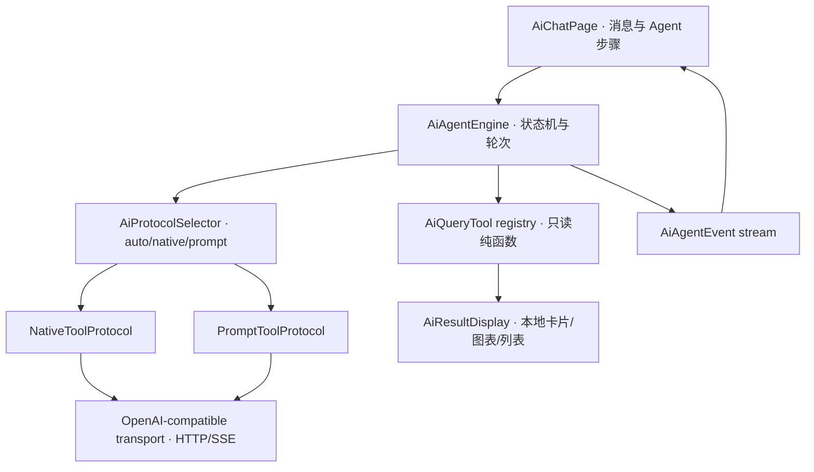
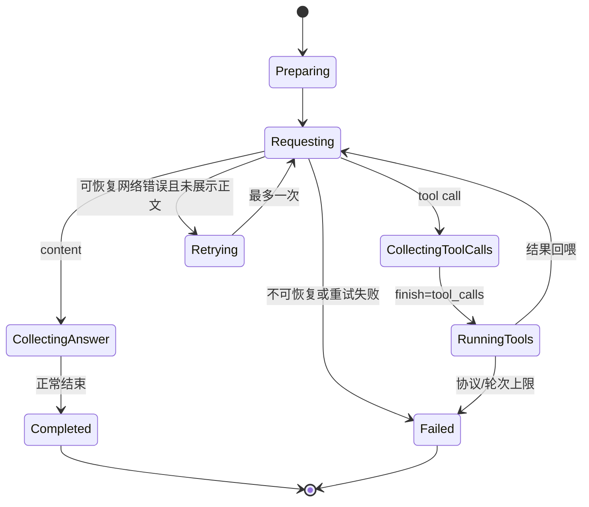

# Issue #32 · AI 财务 Agent 与原生 Tool Calls 设计方案

> 状态：**方案已确认，实施中**
>
> 对应 Issue：[#32「关于 AI 助手的问题」](https://github.com/LumiDesk/verifin/issues/32)
>
> 调研基线：`main` @ `cd3bf33`，应用版本 `1.11.6+90`，日期 `2026-08-06`

## 1. 结论速览

当前“AI 助手”并非完全没有 Agent 能力：`AiChatEngine` 已经具备“模型决定调用工具 →
本地执行只读工具 → 结果回喂模型 → 继续循环直到最终答复”的最小 Agent 循环。但它使用
提示词要求模型输出 `{tool,args}` 文本 JSON 来模拟 Tool Calls，网络层又只向上提供文本增量，
导致协议状态、工具调用和最终回答混在同一文本流里。

Issue #32 的两个现象都能从当前实现得到解释：

- 工具调用只按首个非空白字符识别；模型带前言、思考标签或输出格式稍有偏差时，内部 JSON
  会被当作最终回答渲染；解析失败或达到轮次上限时，当前代码还会主动显示原始内容；
- SSE response body 没有空闲超时、结束标志校验或安全重试，`HttpException` 也没有正确分类，
  所以连接中断会直接变成带底层异常文本的红色错误。

本方案不只修补 JSON 显示，而是把现有最小循环升级为一个**双协议、可观察、只读、安全降级的
AI 财务 Agent**：

1. 设置页增加“自动 / 原生 Tool Calls / 兼容模式”三种工具调用方式；
2. 原生模式使用 OpenAI Chat Completions 兼容的 `tools`、`tool_calls`、`tool_call_id`；
3. 兼容模式继续支持仅能输出文本的本地或第三方模型，但改用显式协议标记和完整兜底解析；
4. Agent 引擎产出结构化的工具步骤事件，聊天页展示“正在查询 / 查询完成 / 查询失败”；
5. 原始 JSON、上游思维链和底层异常永不进入用户可见消息；
6. 工具继续全部只读；未来需要改变数据的能力只能生成草稿或打开确认页面，不能静默落库。

## 2. 目标与非目标

### 2.1 本轮目标

- 根治 Issue #32 的工具 JSON 泄漏和 SSE 断流脆弱性；
- 在不放弃本地模型 / 第三方兼容端点的前提下支持原生 Tool Calls；
- 让用户看见 Agent 调用了什么能力、查了什么范围、是否成功；
- 保持当前工具注册表的可扩展性，让后续新增趋势、预算、账户等工具不修改主循环；
- 保持 AI 配置、聊天历史和能力检测结果仅存本机，不进入 JSON 备份；
- 不新增网络依赖，继续使用 `dart:io HttpClient`，但补齐流式协议与错误处理测试。

### 2.2 明确不做

- 不把 AI 变成可直接增删交易、预算、账户的写入 Agent；
- 不展示或持久化模型的 Chain of Thought / `reasoning_content`；
- 不把原生 Tool Calls 作为唯一通路，避免淘汰 Ollama、LM Studio 和旧兼容端点；
- 不在 Issue #32 同一变更里一次性实现所有规划中的财务工具；
- 不引入账号、服务端代理、遥测或托管 API Key；
- 不修改 SQLite schema、账本备份格式或权威账目数据流。

## 3. 当前实现事实

### 3.1 文件与职责

| 文件 | 当前职责 | 本方案中的问题 / 改造点 |
|---|---|---|
| `lib/app/ai/ai_settings.dart` | `baseUrl`、`apiKey`、`model` 三项本地配置 | 缺少工具协议偏好与能力状态 |
| `lib/pages/ai_settings_page.dart` | 编辑三项配置；`ping → OK` 测连接 | 只能证明普通补全可用，不能检测流式或 Tool Calls |
| `lib/app/ai/ai_client_io.dart` | 非流式补全 + 手写 SSE 文本增量 | 只提取 `delta.content`，丢失 tool calls、reasoning、finish reason；正文无空闲超时 |
| `lib/app/ai/ai_chat_engine.dart` | 提示词工具循环，输出 UI 事件 | 消息是 `Map<String,String>`；首字符判型；原始 JSON 有泄漏分支 |
| `lib/app/ai/ai_query_tool.dart` | 工具接口、注册表、运行结果和结果卡片规格 | `argsSchema` 只是说明文字，不能直接生成原生 JSON Schema |
| `lib/pages/ai_chat_page.dart` | 组装上下文、驱动引擎、渲染消息、保存历史 | 只有一个瞬时 `statusLabel`，失败时用错误覆盖已有正文 |
| `lib/pages/ai_result_view.dart` | 渲染统计、排行、趋势、交易和表格结果 | 可继续复用，不负责展示 Agent 调用步骤 |
| `docs/dev/ai-tools.md` | 当前工具登记与维护约定 | 实现后需更新为双协议约定 |

### 3.2 当前循环

```text
用户问题
  ↓
buildSystemPrompt() 把工具清单写进提示词
  ↓
aiChatStream() 只产出 delta.content
  ↓
AiChatEngine 看首个非空白字符
  ├─ “{” / “`” → 缓冲并解析为工具调用
  │                 ↓
  │               本地运行 AiQueryTool
  │                 ↓
  │               以 user 文本回喂工具 summary
  │                 └───────────────┐
  └─ 其它 → 直接作为最终回答流式展示 │
                                      ↓
                                  下一轮模型请求
```

它具备 Agent 循环，但协议层仍是普通文本，无法可靠地区分“控制消息”和“用户回答”。

### 3.3 Issue #32 的确定性根因

`AiChatEngine.run()` 当前行为：

1. 只要第一段非空文本不是 `{` 或反引号，立即进入 answer 模式；
2. answer 模式后续收到的所有内容都会直接产出 `AiChatAnswerDelta`；
3. `_parseToolCall()` 复用 `extractJsonObject()`，只截取第一个 `{` 到最后一个 `}`；多个对象、
   多余大括号或不完整输出均可能解析失败；
4. `call == null || lastRound` 时主动把 `raw` 作为回答输出。

因此以下模型输出都会泄漏内部协议：

```text
我先查询一下。
{"tool":"queryTransactions","args":{"start":"2026-06-22"}}
```

````text
<think>需要查询第四周的交易。</think>
```json
{"tool":"queryTransactions","args":{...}}
```
````

网络侧的确定事实：

- `HttpClient.connectionTimeout` 只约束建立连接；
- `request.close().timeout()` 只约束收到 response headers 之前的 Future；
- `HttpClientResponse` 的字节流没有 `.timeout()`；
- SSE 是否收到 `[DONE]` / `finish_reason` 没有被记录；
- `HttpException` 落入通用 catch，最终被包装成 `AiErrorCode.unknown`；
- UI 会把 `HttpException: Connection closed while receiving data` 拼进用户可见错误。

不能仅凭 Issue 证明是客户端主动关闭了 DeepSeek / OpenAI 连接；上游、代理或移动网络都可能
提前断开。但当前客户端确实没有把这种可恢复故障处理成可恢复状态。

### 3.4 当前测试缺口

现有 `ai_chat_engine_test.dart` 和 `ai_chat_page_test.dart` 只覆盖理想模型：

- 工具 JSON 从 `{` 或代码块开始；
- SSE 流总能正常完成；
- 未断言轮次超限时不能显示 JSON；
- 未覆盖带前言、思考标签、多个 JSON、分片 tool calls；
- 没有本地 HTTP Server 模拟真实 SSE、超时和连接提前关闭。

## 4. 产品定义：AI 财务 Agent

### 4.1 对用户的承诺

Agent 的价值不是“显示更多技术细节”，而是让回答具备以下属性：

- **真实**：涉及用户账目的数字必须来自本地只读工具；
- **透明**：用户能看见调用了什么工具和查询范围；
- **可验证**：工具结果继续用本地卡片、图表和可点击交易列表展示；
- **可恢复**：网络短暂中断时自动安全重试，失败后提供明确重试入口；
- **可控**：任何未来的数据变更都必须经过草稿 / 页面确认；
- **私密**：不上传原始附件、API Key、完整数据库或无关账本数据。

### 4.2 用户可见命名

建议产品界面继续使用易懂的“AI 助手”或升级为“AI 财务助理”，技术文档和代码使用
`Agent`。不建议在一级界面直接用“Agent”要求普通用户理解行业术语。

### 4.3 不展示思维链

聊天页展示的是**可审计的操作轨迹**，不是模型内部推理：

```text
正在查询交易
  6 月第四周 · 购物支出

查询完成
  找到 4 笔交易
```

允许展示：工具名称、本地化参数摘要、运行状态、结果数量、结果卡片。

禁止展示：`reasoning_content`、Chain of Thought、系统提示词、原始工具 JSON、API Key、
原始上游响应、堆栈和底层异常字符串。

## 5. 设置与能力检测

### 5.1 三态配置，不使用布尔开关

新增：

```dart
enum AiToolCallMode {
  auto,
  native,
  prompt,
}
```

用户文案：

| 值 | 中文 | English | 行为 |
|---|---|---|---|
| `auto` | 自动（推荐） | Auto (recommended) | 检测原生 Tool Calls；不可用时使用兼容模式 |
| `native` | 原生 Tool Calls | Native tool calls | 强制结构化工具协议；不支持时明确报错，不静默改变用户选择 |
| `prompt` | 兼容模式 | Compatibility mode | 强制文本标记协议，面向旧中转和本地模型 |

不增加“关闭工具”作为默认选项。AI 财务查询页在没有工具时无法可靠访问用户账目，退化为普通
聊天反而更容易编造。如果未来需要纯聊天，应作为明确的“纯对话（不读取账目）”独立能力设计。

### 5.2 `AiSettings` 兼容迁移

`AiSettings` 增加 `toolCallMode`，继续存入 `verifin.ai.v1`：

```dart
class AiSettings {
  const AiSettings({
    this.baseUrl = '',
    this.apiKey = '',
    this.model = '',
    this.toolCallMode = AiToolCallMode.auto,
  });
}
```

- 旧 JSON 没有字段时解析为 `auto`；
- `copyWith`、`toJson`、`fromJson`、相等和 hashCode 同步；
- `isConfigured` 仍只要求地址、Key、模型三项；
- AI 记账继续使用普通补全，不受工具调用模式影响；
- AI 配置仍不进备份，初始化数据时保留；
- 清空 AI 配置同时清空能力检测缓存。

### 5.3 能力缓存

建议增加设备本地 KV：`verifin.ai_capabilities.v1`。

```dart
enum AiNativeToolCapability { unknown, supported, unsupported }

class AiCapabilityProfile {
  final String normalizedBaseUrl;
  final String model;
  final AiNativeToolCapability nativeToolCalls;
  final DateTime checkedAt;
  final int protocolVersion;
}
```

- 不存 API Key；
- 地址或模型变化时旧缓存失效；
- 协议实现升级时用 `protocolVersion` 失效旧检测；
- 与 AI 配置一样设备本地、不进备份、初始化保留；
- 清空 AI 配置时删除；
- 网络错误、鉴权失败、限流不能被记成“不支持 Tool Calls”。

Controller 对 capability cache 使用独立 `ValueNotifier<AiCapabilityProfile?>` 暴露状态，沿用主题 / 语言
偏好的窄通知先例；探测结果变化不能调用全局 `notifyListeners()` 让整棵应用树重建。

### 5.4 “测试连接”升级为“检测能力”

检测顺序：

1. 普通非流式 `ping → OK`，验证 URL、鉴权和模型；
2. 一个不含账目数据的最小 SSE 响应，验证流式输出；
3. 提供唯一的 `verifinCapabilityProbe` 工具，明确要求模型调用；
4. 收到合法 `tool_calls` 即标记 supported；
5. 明确的“不支持 tools/tool_choice”响应或成功响应但始终不调用 probe，标记 unsupported；
6. 其它异常显示检测失败，不改已有能力缓存。

状态展示示例：

```text
连接正常
流式输出正常
原生 Tool Calls：支持
AI 助手将使用：原生 Tool Calls
```

能力探测会产生一次极小的模型调用，需要在说明文案中明确，但不会发送任何账目内容。

### 5.5 自动模式选择规则

```text
用户选择 auto
  ├─ capability=supported   → NativeToolProtocol
  ├─ capability=unsupported → PromptToolProtocol
  └─ capability=unknown
       ├─ 先做轻量 probe
       ├─ 支持   → NativeToolProtocol
       ├─ 不支持 → PromptToolProtocol
       └─ 网络/鉴权错误 → 直接报对应错误，不错误降级
```

运行时若原生请求收到明确的协议不支持错误，auto 模式可以在**同一次用户请求**中切到兼容模式，
并更新缓存。`native` 模式尊重用户强制选择，只提示“不支持原生 Tool Calls”。

## 6. 目标架构

### 6.1 分层



### 6.2 建议文件结构

```text
lib/app/ai/
  ai_agent_engine.dart          Agent 状态机、轮次、重试、上下文预算
  ai_agent_event.dart           结构化 UI 事件与 AgentStep
  ai_agent_message.dart         强类型协议消息与 tool call 模型
  ai_agent_protocol.dart        协议接口和 auto 选择
  ai_native_tool_protocol.dart  原生 tools/tool_calls 编解码
  ai_prompt_tool_protocol.dart  文本标记、缓冲和 JSON 容错
  ai_capabilities.dart          probe、能力结果和序列化
  ai_client.dart                条件导出门面
  ai_client_io.dart             HTTP/SSE 传输
  ai_client_stub.dart           非 IO 占位
  ai_query_tool.dart            工具注册表、schema、运行结果
  ai_tool_presentation.dart     工具步骤的本地化展示数据
```

`ai_result_view.dart` 继续只渲染结果；新增 `ai_agent_step_view.dart` 渲染调用轨迹。实现时若形成
可复用组件，需同步 `docs/dev/components.md`。

### 6.3 强类型消息

当前 `List<Map<String,String>>` 无法表达结构化工具消息。目标模型至少包括：

```dart
sealed class AiAgentMessage {}

class AiTextMessage extends AiAgentMessage {
  final AiMessageRole role; // system / user / assistant
  final String content;
}

class AiAssistantToolMessage extends AiAgentMessage {
  final String? content;
  final String? reasoningContent;
  final List<AiNativeToolCall> toolCalls;
}

class AiToolResultMessage extends AiAgentMessage {
  final String toolCallId;
  final String content;
}
```

`reasoningContent` 只在一次 Agent turn 内为兼容思考模型而临时回传，最终完成后立即丢弃：

- 不进入 `_ChatMessage`；
- 不进入 `verifin.ai_chat.v1`；
- 不写 AppLogger；
- 不渲染；
- 下一次独立用户提问只使用用户可见历史，不恢复内部思维链。

### 6.4 结构化传输事件

`ai_client_io.dart` 不再只返回 `Stream<String>`，而是：

```dart
sealed class AiCompletionEvent {}

class AiContentDelta extends AiCompletionEvent {
  final String text;
}

class AiReasoningDelta extends AiCompletionEvent {
  final String text;
}

class AiToolCallDelta extends AiCompletionEvent {
  final int index;
  final String? id;
  final String? nameDelta;
  final String? argumentsDelta;
}

class AiCompletionFinished extends AiCompletionEvent {
  final AiFinishReason reason;
}

class AiStreamDone extends AiCompletionEvent {}
```

原生工具名和 arguments 可能分散在多个 SSE chunk，协议层按 `index` 累积，直到 finish reason
为 `tool_calls` 后才执行。`choices=[]` 的 usage chunk 合法，应忽略但不能当异常。

### 6.5 单一工具 Schema 真源

当前 `Map<String,String> argsSchema` 只能生成提示词，不能生成原生 JSON Schema。改为：

```dart
class AiToolSchema {
  final Map<String, AiToolParameter> properties;
  final Set<String> required;
}

class AiToolParameter {
  final AiToolParameterType type;
  final String description;
  final List<Object?> enumValues;
}
```

由同一份 schema 同时生成：

- 原生 `tools[].function.parameters`；
- 兼容模式系统提示词；
- 参数基础校验；
- 设置页能力探测工具定义；
- 测试中的 schema 快照 / 通用非法参数断言。

工具运行时仍必须自行做领域降级，不能因为有 JSON Schema 就信任模型参数。

## 7. 双协议设计

### 7.1 原生 Tool Calls

请求：

```json
{
  "model": "...",
  "messages": ["...typed messages..."],
  "tools": [
    {
      "type": "function",
      "function": {
        "name": "queryTransactions",
        "description": "...",
        "parameters": {"type":"object","properties":{}}
      }
    }
  ],
  "tool_choice": "auto",
  "stream": true
}
```

循环：

1. 累积 `delta.tool_calls[index]`；
2. finish reason=`tool_calls` 后校验 id、name、arguments；
3. 只允许调用注册表内工具；
4. 产出 `AiAgentToolStarted`；
5. 本地执行工具并产出 `AiAgentToolCompleted` / `AiAgentToolFailed`；
6. 把完整 assistant tool call 消息和对应 `role=tool` 结果加入临时上下文；
7. 发下一轮请求；
8. content delta 作为最终回答流式展示。

同一响应若返回多个 tool calls，第一阶段按 index **顺序执行**，保证事件顺序和测试确定性。
当前工具都是同步只读纯函数，没必要为几个毫秒的计算引入并发。未来出现独立异步工具后再评估并行。

### 7.2 兼容提示词协议

不能再依赖首字符。系统提示词要求两种显式标记：

```text
VERIFIN_TOOL
{"tool":"queryTransactions","args":{...}}
```

```text
VERIFIN_ANSWER
最终给用户的 Markdown 答复……
```

解析规则：

- 检测到 `VERIFIN_ANSWER` 后去掉标记，后续内容可以继续真流式展示；
- 检测到 `VERIFIN_TOOL` 后整轮缓冲，完成后解析并静默执行；
- 模型未遵守标记时整轮缓冲，不向 UI 发任何暂定文本；
- 缓冲完成后用“平衡大括号 + 字符串转义感知”的扫描器逐个提取 JSON 对象；
- 只接受 `tool` 为注册工具、`args` 为对象的候选；
- 找到工具调用时，前后解释文字全部视为内部协议噪声，不展示；
- 没有工具调用时才把完整内容作为最终回答；
- 工具 JSON 解析失败、未知工具、轮次超限时产出类型化协议错误，**绝不回显 raw**。

这样，遵守新标记的模型保留真流式体验；不遵守标记的旧模型会稍晚一次性显示最终回答，但不会
泄漏机器码。正确性优先于首 token 延迟。

### 7.3 不以原生协议替代兼容协议

原生协议是首选路径，不是唯一入口。原因：

- 项目允许用户填写任意 OpenAI 兼容端点；
- 部分本地 / 中转服务接受 `chat/completions`，但拒绝 `tools` 或不正确流式返回 tool calls；
- 能力属于“地址 + 中转 + 模型”整条链路，不能只按模型名硬编码；
- 兼容协议也是原生协议故障时的重要可用性兜底。

## 8. Agent 状态机与 UI 事件

### 8.1 状态机



### 8.2 事件模型

```dart
sealed class AiAgentEvent {}

class AiAgentToolStarted extends AiAgentEvent {
  final AiAgentStep step;
}

class AiAgentToolCompleted extends AiAgentEvent {
  final AiAgentStep step;
  final AiResultDisplay? display;
}

class AiAgentToolFailed extends AiAgentEvent {
  final AiAgentStep step;
}

class AiAgentAnswerDelta extends AiAgentEvent {
  final String delta;
}

class AiAgentRetrying extends AiAgentEvent {
  final int attempt;
}

class AiAgentCompleted extends AiAgentEvent {}
class AiAgentFailed extends AiAgentEvent {}
```

`AiAgentStep` 至少含：

- `callId`：本轮唯一 id；
- `toolName`：注册工具名；
- `normalizedArgs`：校验 / 归一后的安全参数；
- `status`：running / succeeded / failed；
- `resultSummary`：面向步骤卡的短摘要，不等同于回喂模型的完整 summary；
- `durationMs`：可选，只用于用户体验和本地诊断。

### 8.3 聊天页改造

`_ChatMessage.statusLabel` 改为 `List<AiAgentStep>`：

```dart
class _ChatMessage {
  final _Role role;
  String text;
  final List<AiAgentStep> steps;
  final List<AiResultDisplay> displays;
  _MsgStatus status;
  String? userFacingError;
}
```

建议布局：

```text
┌ 正在查询交易                                  ◌ ┐
│ 6 月第四周 · 购物支出                            │
└───────────────────────────────────────────────┘

┌ 查询交易                                      ✓ ┐
│ 找到 4 笔交易                                    │
└───────────────────────────────────────────────┘

[本地交易列表卡片]

最终 Markdown 分析……
```

- 步骤卡默认紧凑；完成后可折叠；
- 参数必须转成人类语言，禁止显示参数 JSON；
- 失败步骤提供简短原因，底层 detail 仅进日志；
- 已有 `AiResultView` 放在对应完成步骤之后或统一放在步骤列表下方；
- 工具名和状态文案必须走中英文 ARB；
- 不直接写新弹窗；需要选择协议时用既有 `showOptionSheet`。

### 8.4 工具步骤的本地化

工具纯函数层不能依赖 `BuildContext`。新增独立 presenter：

```dart
AiToolStepPresentation presentAiToolStep(
  AppLocalizations l10n,
  String toolName,
  Map<String, Object?> normalizedArgs,
  AiToolResult? result,
)
```

它把：

```json
{"range":"lastMonth","type":"expense","limit":20}
```

转换为：

```text
查询交易
上月 · 支出 · 最多 20 笔
```

未知工具使用通用文案，不把原始字段拼到 UI。

### 8.5 历史持久化

`verifin.ai_chat.v1` 继续保存用户可见历史，可新增 `steps`：

```json
{
  "role": "assistant",
  "content": "最终回答",
  "steps": [
    {
      "tool": "queryTransactions",
      "args": {"range":"lastMonth","type":"expense"},
      "status": "succeeded",
      "summary": "找到 4 笔交易"
    }
  ],
  "displays": []
}
```

- 只持久化已完成 / 已失败步骤，不持久化 running；
- 不存 native raw tool call、reasoning、系统提示词或底层异常；
- 旧历史没有 `steps` 时按空列表读取；
- 交易卡仍只保存 entry id，重开按当前账目解析；
- 聊天历史仍是设备本地、不进备份、初始化保留；
- 清空聊天历史同时清空步骤。

## 9. 网络可靠性

### 9.1 超时边界

区分：

- 连接超时：建立 TCP/TLS；
- 首包超时：提交请求到收到 response headers；
- SSE 空闲超时：响应流连续一段时间无任何字节事件；
- 用户取消：主动终止当前 subscription / client。

建议初值：

| 阶段 | 初值 | 说明 |
|---|---:|---|
| connect | 20 秒 | 移动网络建立连接 |
| response headers | 60 秒 | 推理模型可能首 token 较慢 |
| stream idle | 45 秒 | 每收到字节事件重新计时 |

不设置很短的固定总时长截断完整回答；未来若需要总上限，应独立配置并真机验证推理模型。

### 9.2 SSE 完整性

客户端记录：

- 是否收到任何响应 chunk；
- 是否收到 content / reasoning / tool call delta；
- 最后一个 finish reason；
- 是否收到 `[DONE]`；
- 是否发生字节流异常。

兼容判定：

- `[DONE]`：完整；
- 某些兼容端点没有 `[DONE]`，但有合法终态 finish reason：可接受并记录兼容降级；
- 两者都没有：`incompleteStream`，不得静默当成功；
- `finish_reason=length`：保留已生成文字并提示回答被截断；
- `content_filter` / `insufficient_system_resource`：映射为类型化上游错误。

### 9.3 重试策略

自动重试最多一次，只处理：

- `SocketException`；
- `HttpException`（含 connection closed）；
- `TimeoutException`；
- 没有合法终态的 incomplete stream；
- 上游明确的临时资源错误。

不自动重试：鉴权失败、404、参数错误、额度 / 限流、确定的协议不支持、工具参数非法。

可见性规则：

- 尚未展示任何最终 answer delta：自动重试，工具步骤保留；
- 已展示部分回答：不自动把第二份回答直接追加，避免重复或语义冲突；保留部分文字并提供“重新回答”；
- 工具都是只读，重新执行不会改变账目，但仍可能产生额外模型费用；自动次数固定为 1；
- auto 模式第一次原生协议明确不支持时切换兼容模式不计作网络重试。

### 9.4 非流式兜底

首次 SSE 在任何用户可见正文前失败时，第二次请求可使用非流式 `aiChatComplete`：

- 避开部分代理对长连接 / chunked SSE 的兼容问题；
- 完整响应经过同一协议解析后再显示；
- 设置步骤状态为“已重新连接”，不展示底层异常；
- 原生 tool call 的非流式响应同样要解析 `message.tool_calls`，不能只取 content。

### 9.5 错误与日志

用户可见：

```text
连接中断，已自动重试。
```

```text
回答中断，请重试。
```

本地日志允许记录：错误码、协议模式、轮次、attempt、finish reason、是否已经出现可见正文。

禁止记录：API Key、Authorization、完整 URL 查询参数、用户问题全文、工具完整结果、交易备注、
reasoning content、原始请求 / 响应正文。

`aiErrorMessage()` 对网络类错误不再拼接原始 detail；detail 只交给 `AppLogger`。

## 10. 上下文与结果边界

### 10.1 可见历史与请求历史分离

聊天页仍可保存最近 40 条可见消息，但每次发给模型的历史增加双重预算：

```dart
const int maxPriorMessages = 12;
const int maxPriorCharacters = 12000;
```

- 从最新消息向前取完整 user/assistant 对；
- 当前用户问题永不截断；
- 不发送 error / running 消息；
- 结果卡片不序列化进模型上下文，最终文字已提供必要语义；
- 截断只影响模型上下文，不删除本地聊天历史。

### 10.2 工具回喂长度

统一增加：

```dart
const int maxToolSummaryCharacters = 4000;
```

- `display` 保留完整的本地展示数据；
- 只截断发往模型的 `summary`；
- 截断标记需明确告诉模型“结果已截断”；
- 优先由每个工具生成紧凑 summary，统一上限只是最后防线。

当前 `docs/dev/ai-tools.md` 声称“单次回喂结果做截断”，但源码没有通用截断。本方案实现时要
让文档与代码重新一致。

### 10.3 Agent 循环上限

建议：

```dart
const int maxToolRounds = 5;
const int maxToolCallsPerTurn = 10;
```

- 一轮可含多个原生 tool calls；
- 超限时产出用户友好的协议失败，不显示最后一轮 JSON；
- 已完成的本地结果卡仍可保留，方便用户判断 Agent 查过什么；
- 日志记录超限的工具名序列，不记录 args。

## 11. 安全与隐私不变量

1. `buildAiQueryTools()` 注册的工具必须继续只读、纯函数，不访问 Controller；
2. Agent 只能调用注册表白名单，模型自造工具名不得动态反射或执行；
3. 所有 args 即使来自原生 JSON Schema 也必须重新校验；
4. 工具执行使用发问时的 `AiToolContext` 快照，不在一个 turn 中跨账本漂移；
5. 回喂模型的只有紧凑 summary；`AiResultDisplay` 的完整 entry ids / 图表规格留在本地；
6. reasoning 仅为协议兼容临时持有，不展示、不记录、不持久化；
7. capability probe 不发送账目；
8. AI 配置和能力缓存均不进备份；
9. 将来若需要“帮我记账 / 调预算”，只能产出草稿或导航动作并由用户确认，不能注册写工具；
10. 切换账本后新的提问使用新快照；进行中的 turn 不允许无提示换数据源。

## 12. 工具扩展路线

Issue #32 第一阶段只迁移现有工具，不同时增加业务口径：

- `summary`
- `categoryRanking`
- `tagRanking`
- `queryTransactions`
- `largestTransactions`

Agent 基础稳定后，按独立变更逐步实现 `docs/dev/ai-tools.md` 已登记的：

- `trend`
- `compare`
- `accountsOverview`
- `netWorth`
- `budgetStatus`
- `creditCardBill`

每个新工具仍遵守“实现 + 注册 + 正常/非法参数测试 + 文档登记”。工具数量不是目标；优先选择
能回答真实用户问题、已有可靠纯函数口径的能力。

## 13. 具体改动清单

### 13.1 新增文件

- `lib/app/ai/ai_agent_engine.dart`
- `lib/app/ai/ai_agent_event.dart`
- `lib/app/ai/ai_agent_message.dart`
- `lib/app/ai/ai_agent_protocol.dart`
- `lib/app/ai/ai_native_tool_protocol.dart`
- `lib/app/ai/ai_prompt_tool_protocol.dart`
- `lib/app/ai/ai_capabilities.dart`
- `lib/app/ai/ai_tool_presentation.dart`
- `lib/pages/ai_agent_step_view.dart`
- `test/ai_agent_engine_test.dart`
- `test/ai_agent_protocol_test.dart`
- `test/ai_client_io_test.dart`
- `test/ai_capabilities_test.dart`

最终文件数量可在实现时按复杂度合并，不能为追求分层制造只有几十行且无独立职责的碎文件。

### 13.2 修改文件

- `lib/app/ai/ai_settings.dart`：三态模式、序列化兼容；
- `lib/app/ai/ai_client_io.dart`：结构化 SSE、非流式 tool calls、超时和完成校验；
- `lib/app/ai/ai_client_stub.dart`：同步新接口；
- `lib/app/ai/ai_query_tool.dart`：单一 typed schema 真源；
- `lib/pages/ai_settings_page.dart`：协议选择、能力检测状态；
- `lib/pages/ai_chat_page.dart`：改接 Agent events、步骤、错误与历史；
- `lib/app/veri_fin_controller*.dart`：能力缓存的设备本地读写、清理与独立 ValueNotifier 生命周期；
- `lib/l10n/app_zh.arb`、`app_en.arb`：全部新文案；
- `test/ai_settings_test.dart`：旧配置默认、冷启动、清空、备份排除；
- `test/ai_chat_page_test.dart`、`ai_chat_history_test.dart`：步骤渲染与恢复；
- `docs/dev/ai-tools.md`、`tech-decisions.md`、`CLAUDE.md`：实现完成后同步当前事实；
- `CHANGELOG.md`：实现完成后在 Unreleased 记录 Issue #32 修复与 Agent 升级。

### 13.3 删除 / 迁移

- 全部调用点迁移后直接删除 `ai_chat_engine.dart`，不保留旧聊天引擎或兼容 barrel；
- 删除首字符 `_RoundMode` 判型和“解析失败回显 raw”的分支；
- `AiChatToolInvoked` / `AiChatToolDisplay` 迁移为新的 Agent step 事件；
- `_ChatMessage.statusLabel` 迁移为 steps + userFacingError。

## 14. 分阶段实施计划

每一步保持可编译、可测试，提交相对独立。

### 阶段 1：设置、Schema 与强类型基础

- 增加 `AiToolCallMode` 和旧配置兼容；
- 引入强类型消息、tool call、finish reason；
- 把现有五个工具迁到 typed schema；
- 由 schema 同时生成兼容提示词描述和原生 tools JSON；
- 补 settings / schema 单测；
- 此阶段不改变生产聊天行为。

验收：旧 KV 读取为 auto；五个工具原行为和非法参数测试不变。

### 阶段 2：结构化 HTTP/SSE 客户端

- 改造流式 / 非流式 response parser；
- 支持 content、reasoning、tool call delta 和 finish reason；
- 增加 response body idle timeout、`HttpException` 映射和完整性校验；
- 用本地 `HttpServer` 覆盖标准、分片、断流、缺 `[DONE]`、超时；
- 保持条件导出和测试 stub 对齐。

验收：不接真实服务也能确定 SSE 状态机正确。

### 阶段 3：双协议 Agent 引擎

- 实现 `NativeToolProtocol`；
- 实现带标记和安全缓冲的 `PromptToolProtocol`；
- 实现 Agent 轮次、多个 tool calls、上限、上下文预算、summary 截断；
- 实现一次安全重试和非流式兜底；
- 把现有引擎测试迁成 Agent 测试，并补 Issue #32 回归用例。

验收：任何工具协议分支都不产生含 `{"tool":` 的 answer delta。

### 阶段 4：能力检测与设置页

- 增加能力缓存及生命周期；
- 设置页增加三态选择；
- “测试连接”升级为能力检测；
- 实现 auto 选择和原生不支持时的兼容降级；
- 完成中英文 ARB 和 Widget 测试。

验收：用户能明确看见当前实际使用的协议，手动选择可覆盖 auto。

### 阶段 5：Agent 步骤 UI 与历史

- `_ChatMessage` 接入 steps；
- 展示 running/succeeded/failed/retrying；
- 工具参数经过 presenter 本地化；
- 保持结果卡、图表、交易跳转；
- 完成步骤随历史恢复；
- 部分回答中断时保留文字并提供重试，不显示底层异常。

验收：用户能理解 Agent 做了什么，但看不到 JSON、reasoning 或异常堆栈。

### 阶段 6：文档、全量验证与真机矩阵

- 更新 `ai-tools.md`、`tech-decisions.md`、`CLAUDE.md`、组件清单和 CHANGELOG；
- `dart format .`；
- `flutter analyze`；
- AI 专项测试；
- `flutter test` 全量；
- 使用真实 Android 设备验证 OpenAI、DeepSeek 与至少一种兼容模式端点。

## 15. 自动化测试矩阵

### 15.1 设置与持久化

- 旧 `AiSettings` JSON 缺 mode → auto；
- auto/native/prompt 编解码往返；
- 修改地址或模型使能力缓存失效；
- 清空配置删除能力缓存；
- 重启恢复设置和能力结果；
- AI 配置 / capability 不进备份；
- resetAllData 保留二者。

### 15.2 原生协议

- 单工具调用；
- 多 tool calls 按 index 分片；
- name / arguments 跨多个 chunk；
- assistant content + tool_calls 同时出现时只展示符合协议的最终 content；
- reasoning delta 被临时累积但从不进入 UI event/history/log；
- 未知工具、空 id、非法 arguments；
- finish reason=tool_calls 后继续下一轮；
- 最终 answer 流式完成。

### 15.3 兼容协议

- `VERIFIN_TOOL` / `VERIFIN_ANSWER` 跨 chunk；
- 原始 `{tool,args}` 旧格式；
- Markdown code fence；
- 工具 JSON 前有解释文字；
- `<think>...</think>` 后调用工具；
- 嵌套 args、字符串内大括号；
- 多个 JSON 对象；
- malformed JSON；
- 未知工具；
- 工具轮次超限；
- 所有上述工具分支均断言 answer delta 不含 raw JSON。

### 15.4 网络

- 标准 SSE + `[DONE]`；
- 只有 finish reason、无 `[DONE]` 的兼容流；
- 两者都无 → incomplete；
- response headers 超时；
- body idle timeout；
- 首 chunk 前 connection closed → 自动重试成功；
- 工具轮结束后、最终回答前断流 → 非流式兜底成功；
- 已显示部分回答后断流 → 保留部分文字和重试入口；
- 401/404/429/5xx；
- `HttpException` 不出现在用户文案。

### 15.5 UI 与历史

- running → succeeded 步骤；
- 多工具步骤顺序；
- 工具结果卡片仍可点击；
- 重试状态；
- 失败状态不覆盖部分回答；
- 重启恢复 completed steps 和 displays；
- 清空历史；
- 中英文文案；
- 聊天消息中找不到 `{"tool"`、`tool_calls`、`reasoning_content`、`HttpException`。

## 16. 真机验收矩阵

至少验证：

| 端点类型 | 模式 | 必测场景 |
|---|---|---|
| OpenAI 官方或确认支持原生 tools 的兼容端点 | auto + native | 单工具、多工具、流式最终回答 |
| DeepSeek 官方普通 / 思考模型 | auto + native | reasoning 不显示、工具轮可继续、最终回答完整 |
| 不支持原生 tools 的本地 / Mock 端点 | auto + prompt | 自动降级、标记协议、无 JSON 泄漏 |
| 人工注入断流的测试端点 | auto | 自动重试、非流式兜底、友好失败 |

通用验收问题：

- “帮我查 6 月第四周的购物消费明细”；
- “本月花了多少，最大的五笔支出是什么”；
- “这个月哪个分类花得最多”；
- “你好”（不需要账目工具的直接回答）；
- 连续追问“其中最大的一笔是什么”。

验收观察：

- 工具过程为人类可读步骤；
- 结果来自当前账本且卡片可打开；
- 不出现 JSON / reasoning / 底层错误；
- 切换账本后新问题不泄漏旧账本结果；
- 退出重开后步骤与结果可恢复；
- 弱网下至多自动重试一次，不出现无限转圈或重复回答。

## 17. 风险与缓解

### R1 · “OpenAI 兼容”并不等于支持原生 Tool Calls

缓解：三态选择、端到端 probe、auto 明确降级、手动 native 可覆盖。

### R2 · 能力检测误判

缓解：网络 / 鉴权错误不写 unsupported；检测结果绑定地址、模型和协议版本；设置页允许手动选择。

### R3 · 思考模型要求回传 reasoning

缓解：结构化 transport 保留单次 Agent turn 内的 reasoning 字段；仅协议回传，禁止显示 / 持久化。

### R4 · 自动重试增加费用

缓解：仅瞬态故障、最多一次、已显示正文不自动重复；状态卡说明“已重新连接”。

### R5 · Agent UI 变得嘈杂

缓解：步骤卡紧凑、完成后折叠；结果卡和最终回答保持视觉主角；不显示每个网络 chunk。

### R6 · 双协议维护成本

缓解：单一工具 schema、单一 Agent 状态机；协议层只负责编解码，不复制工具业务逻辑。

### R7 · 聊天历史膨胀

缓解：存储仍限 40 条，请求另限 12 条 / 12000 字符；步骤只存摘要，不存内部 transcript。

## 18. 完成标准

满足以下条件才可认为 Issue #32 与 Agent 第一阶段完成：

- 自动、原生、兼容三种模式均有持久化与测试；
- OpenAI-compatible 原生 tool calls（流式和非流式）可完整编解码；
- DeepSeek 思考字段不泄漏并能完成工具循环；
- 兼容模式对非理想模型输出不泄漏 raw JSON；
- 连接提前关闭可安全重试 / 降级，最终错误不显示底层异常；
- 工具步骤有 running/success/failure 状态和中英文 UI；
- 已有结果卡、历史、清空、账本隔离行为不回归；
- AI 工具保持只读，没有任何静默写数据路径；
- 专项测试、`flutter analyze`、全量 `flutter test` 通过；
- 至少三类真实 / 模拟端点完成 Android 真机验收；
- `docs/dev/ai-tools.md`、`tech-decisions.md`、`CLAUDE.md`、组件清单和 CHANGELOG 与实现一致。

## 19. 推荐决策

本方案建议直接确认以下默认值：

1. 用户文案使用“AI 财务助理”，技术实现使用 `AiAgent*`；
2. 工具调用方式默认 `auto`；
3. auto 优先原生 Tool Calls，明确不支持时兼容降级；
4. 不提供含义模糊的“支持工具调用”布尔开关；
5. 展示工具操作轨迹，但永不展示思维链；
6. Agent 第一阶段只迁移现有五个只读工具，不顺手扩展业务能力；
7. 自动网络重试最多一次，已展示部分正文后改由用户主动重试；
8. 任何未来写操作都只能生成草稿 / 导航确认，不注册直接写入工具。

用户已确认不保留纯聊天模式：AI 对话页统一运行 Agent，引擎根据端点能力选择原生或兼容
工具协议；实现完成后必须删除被替代的旧引擎、旧事件和废弃解析分支。

这些决策同时解决 Issue #32、保留现有兼容性，并为后续增加真正有价值的财务分析工具提供稳定基础。
